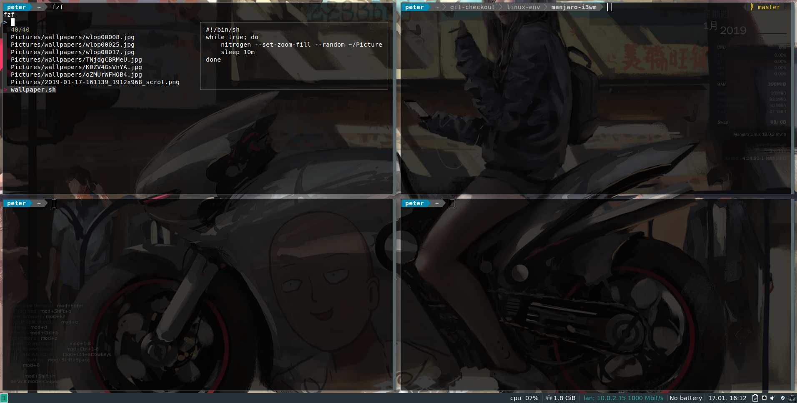
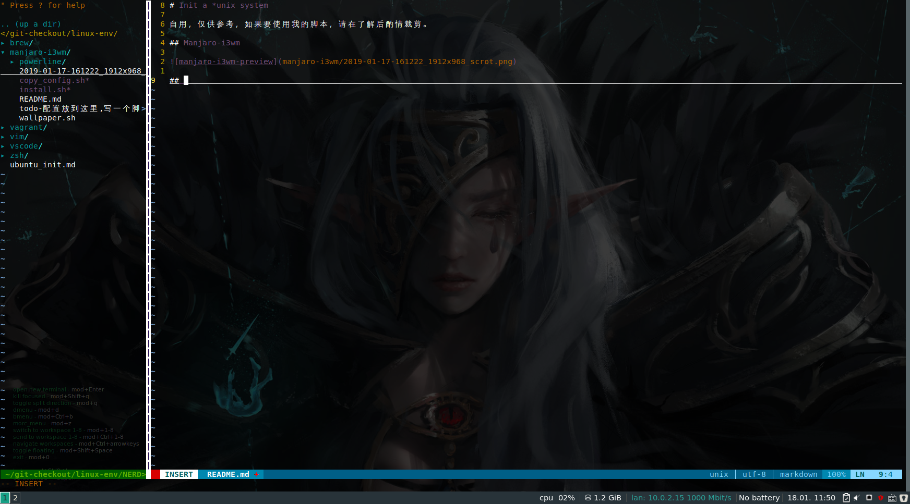

# Init a *unix system

自用，仅供参考，如果要使用我的脚本，请在了解后酌情裁剪。

## debian

用于初始化一些系统环境和工具。

推荐，先下载再剪裁：

    wget https://raw.githubusercontent.com/26huitailang/linux-env/master/debian/starter.sh

执行所有（不推荐）：

    apt update && \
    wget https://raw.githubusercontent.com/26huitailang/linux-env/master/debian/starter.sh -O starter.sh && \
    chmod +x starter.sh && \
    ./starter.sh

## Manjaro-i3wm

## zsh

- manjaro-i3wm/.zshrc, suitable for linux
- this fold suitable for mac

## vim

copy from manjaro-i3wm/.vimrc

## vagrant

Personal use vagrant config file. May not suitable for you.

If you want to try this. `Box url` is in `vagrant/README.md`. Follow the vagrant offitial tutorial.

## others

not useful
