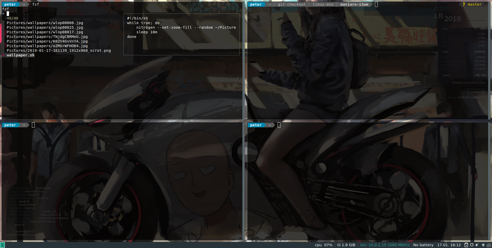

# 瞎几把折腾

## screenshot




## config

拷贝到这里管理,修改后运行copy_config.sh 到相应目录

- .xprofile, 开机启动的一些配置
- .Xresources, urxvt配置
- .zshrc
- powerline folder, 自定义的配置
- .i3/config
- wallpaper.sh, nitrogen自动更换壁纸的脚本
- .npmrc, source
- .pip/pip.conf, source

## install.sh

- pacman source
- firefox firefox-i18n-zh-cn
- fcitx-sogoupinyin
- openssh
- fonts
- sync clock
- zsh
- python
- autojump
- netease-cloud-music
- fzf, 系统已有
- rofi ? dmenu够用先不换
- pycharm-community
- enpass-bin
- visual-studio-code-bin
- gitkraken, git gui tool

## 还要做

### 选一个好看的字体

Source Code Pro有点丑
WenQuanYi Zen Hei Mono稍微能看一点,还是MAC舒服

- 已安装字体, `fc-list | cut -d: -f2`
- `fc-cache -fv` 刷新字体缓存

### 输入法

- 搜狗开机启动，`～/.i3/config`
  - `exec --no-startuo-id fcitx`
  - 也可以是`.xprofile`, `fcitx &`

## status bar

- [x] 网络显示
- [x] 时间显示
- [] 默认是i3bar（i3status只是状态数据），其他的bar，polybar，github上有

## tools

- [] rofi replace dmenu, 现在暂时用着dmenu, 够用

## terminal

- [x] 替换掉urxtterminal，pacman -S xfce4-terminal，然后在启动里面把mod+Enter设置为xfce4-terminal
  - 可以直接在工具栏用鼠标修改属性，更易用一点，既然i3也是有鼠标的，把经理放在其他东西上
- [x] xfce4-terminal 替换 urxvt,透明度需要安装compton,然后启动`compton -b`,可以加入.xprofile开机后启动,这样xfce4-terminal的opacity不会报错
  - opacity 推荐0.77左右
- .Xresources 修改urxrt字体,`xrdb -merge .Xresources`生效设置

  ```conf
  xft.dpi:125  #设置dpi，对4k高分屏需要设置，设置成默认值的2倍试试。
  URxvt.font: xft:Source Code Pro:antialias=True:pixelsize=14,xft:WenQuanYi Zen Hei:pixelsize=14
  URxvt.boldfont: xft:Source Code Pro:antialias=True:pixelsize=14,xft:WenQuanYi Zen Hei:pixelsize=14
  ```

## python

3.3以后自带venv工具，`python -m venv venv`，也可以安装使用virtualenv工具.

## powerline custom

in archlinux powerline_root `/usr/lib/python3.7/site-packages/powerline`

export 路径 `$XDG_CONFIG_HOME`, `~/.config` , 在这个目录下建powerline目录

比如修改tmux的配置;

    cp /usr/lib/python3.7/site-packages/powerline/config_files/themes/tmux/default.json ~/.config/powerline/themes/tmux/default.json

其他的看官方文档修改, https://powerline.readthedocs.io/en/master/configuration.html

- mkdir -p ~/.config/powerline/themes/shell
- cp /usr/lib/python3.7/site-packages/powerline/config_files/themes/default.json ~/.config/powerline/themes/shell/

## 壁纸

- [x] 透明度? 换成xfce4-terminal, opacity around 0.77
- [x] 壁纸? mode+d, `nitrogen` window manager, `man nitrogen` documentation
- [x] 自动更换的话,可以写个脚本自动更换 [wallpaper.sh](./wallpaper.sh)

## ranger ?

- [x] 图标为方块问题?没有安装icons, `ttf-font-awesome`
- [] 还有其他更好看的icons font吗?

## conky

- 桌面时钟显示方框，修改conky
  - `/usr/share/conky/conky_maia` 21:25, `font Bitstream Vera Sans` -> `font WenQuanYi Zen Hei`
  - 字体在安装的里面选择
- [x] 更好看的conky显示
  - i3 edition路径 `/usr/share/conky`,加入自定义的配置
  - 修改`/usr/bin/start_conky***`的脚本
  - 然后修改 `.i3/config` 下面启动的配置
  - icon文件，在[web](http://mathew-kurian.github.io/CharacterMap/)打开`fa-*`，选择喜欢的把Character放到对应的conky配置中即可。保存conky自动刷新。
- [x] 关于AwesomeFont显示问题，已经安装了`ttf-font-awesome`, conky不显示
  - 配置中用的是`FontAwesome`, 用命令`fc-list | grep -i awesome`可以看到没有对应的font，需要的可以改成FontAwesome5Free之类的，看icon属于哪个文件。
  - fc-cache -fv，刷新缓存

## statusbar

下面默认的bar不是很好看,考虑换成powerline

- [] powerline

## keybindings 键盘绑定

- [] 空间命名
- [] 启动应用发送到指定workspace

## bluetooth

参考arch wiki

- 用bluetooth,开机启动
- 配合palseaudio管理声音的输入输出
- 如果没有声音尝试重启网易云音乐

## nodejs

安装nvm版本控制。

- nvm ls-remote , 查看版本
- nvm install VERSION
- npm install -g @vue/cli
- 项目 npm install -s
